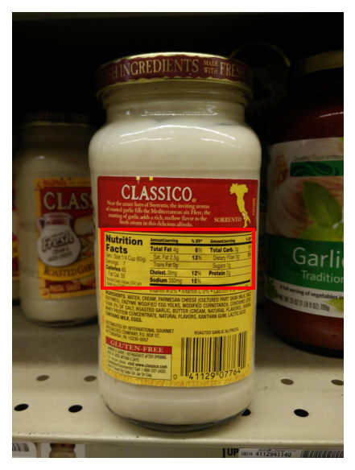
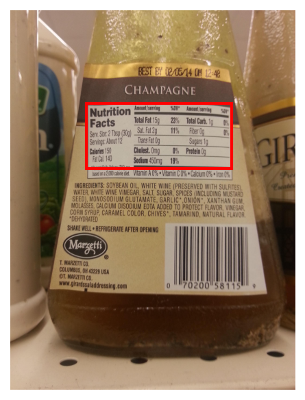
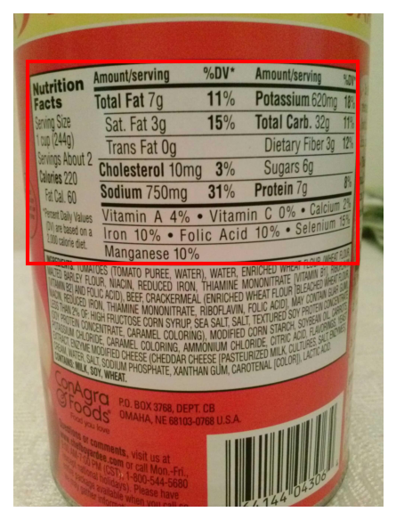

# Nutrition Table Detection with Qwen2-VL-7B

Fine-tuning a 7B vision-language model to localize nutrition tables in real-world product
photographs — and serving it at **17.8 requests/second** on a single GPU.

The model takes a product image and emits bounding boxes as text tokens, using Qwen2-VL's
native grounding vocabulary. No detection head, no anchor boxes — localization is learned
entirely as a sequence-generation task.

[](https://github.com/MKDehdashti/qwen2-vl-nutrition-table/actions/workflows/ci.yml)
[](https://huggingface.co/MayaKD/qwen2-vl-7b-nutrition-vllm)
[](https://huggingface.co/datasets/openfoodfacts/nutrition-table-detection)
[](LICENSE)

| | | |
|:---:|:---:|:---:|
|  |  |  |
| Cluttered shelf, small target | Angled label, glare | Tight crop, wide table |

*Model predictions on held-out validation images. Red box is the model's output; no ground
truth is drawn.*

---

## Results

Shipped model **exp13**, evaluated on all 123 validation samples:

| Metric | Value | |
|--------|:-----:|---|
| Mean IoU | **0.82** | measured |
| Precision@0.5 | 0.91 | upper bound — see below |
| Recall@0.5 | 0.89 | upper bound — see below |
| F1@0.5 | 0.90 | upper bound — see below |

Accuracy is identical across serving backends — same weights, so HF `transformers` and vLLM
agree to within measurement noise.

> **The threshold metrics are being re-measured.** The original implementation counted every
> cell of the IoU matrix above 0.5 rather than performing one-to-one matching, so N
> overlapping predictions against one ground-truth box scored N true positives — which could
> push recall above 1.0. The bias is strictly upward, so the corrected figures will be equal
> or lower; the published numbers are upper bounds until a GPU re-run lands.
>
> **Mean IoU is unaffected.** It is threshold-free and never used the matching path, so 0.82
> stands as measured.
>
> The fix is in [`metrics.py`](nutrition_table_fine_tuning/src/metrics.py) with a regression
> test covering the exact failure case. Finding this is what motivated the test suite.

### Serving performance (single GPU, 123 val samples)

**vLLM under concurrent load** — real async concurrency, the production path:

| Concurrency | Mean latency | P95 | Throughput |
|:-----------:|:------------:|:---:|:----------:|
| 1 | 1,378 ms | 1,506 ms | 0.73 req/s |
| 4 | 399 ms | 467 ms | 9.89 req/s |
| **8** | **435 ms** | 1,056 ms | **17.82 req/s** |
| 16 | 16,528 ms | 22,653 ms | 0.94 req/s |

Throughput scales cleanly to **c=8 (17.8 req/s, a 24× gain over sequential)**, then collapses
at c=16 — 0.94 req/s with a 22-second P95 — as the scheduler saturates and requests queue
behind each other. Pick **c=4** when P95 matters, **c=8** to maximize throughput, and never
c=16 on this hardware.

**HuggingFace `transformers` with batching** — the offline/evaluation path:

| Batch | Mean latency/sample | P95 | VRAM |
|:-----:|:-------------------:|:---:|:----:|
| 1 | 890 ms | 989 ms | 17.2 GB |
| 4 | 475 ms | 483 ms | 20.4 GB |
| 16 | 321 ms | 533 ms | 29.9 GB |

vLLM's 72 GB footprint is deliberate KV-cache pre-allocation for continuous batching, not a
leak — which is why HF is the better choice for offline work on constrained hardware.

Raw measurement files, including a documented negative result, are committed under
[`nutrition_table_inference/outputs/`](nutrition_table_inference/outputs/README.md).

---

## Engineering highlight: silent weight corruption on multi-GPU merges

The most interesting bug in the project produced no error and no warning.

After multi-GPU training, evaluating the in-memory model gave **IoU 0.794**. Saving that same
model and reloading it gave **0.300**. Identical weights in theory; a 62% accuracy loss in
practice.

The cause: every rank was calling `merge_and_unload()` and `save_pretrained()` simultaneously,
so all processes wrote to the same shard files concurrently and interleaved their output. The
resulting checkpoint was structurally valid — it loaded without complaint — but numerically
garbage.

The fix is small once located: guard the merge behind `accelerator.is_main_process` and fence
it with `wait_for_everyone()` barriers on both sides. A second fix was needed for multi-stage
training, where each stage must load the *previously merged directory* rather than restacking
adapters. Post-fix, pre-merge and post-merge evaluations agree within ~1%.

Isolating it required a series of `_merge_test_repro_*` runs that bisected the training
pipeline, since the failure was invisible until a full reload-and-evaluate cycle.

---

## Approach

LoRA fine-tuning of `Qwen/Qwen2-VL-7B-Instruct`, applied progressively across up to three
stages. After each stage the adapters are merged into the base, so every stage begins from
clean full weights rather than stacked adapters.

| Stage | LoRA targets | Purpose |
|-------|--------------|---------|
| 1 — Vision warmup *(optional)* | Last 8 vision blocks | Orient the vision encoder |
| 2 — Full vision | All vision blocks + merger MLP | Visual feature learning |
| 3 — Joint | Vision + LLM self-attention & MLP | Vision–language alignment |

Training runs on `SFTTrainer` + `accelerate` with BF16, Flash Attention 2, and fused AdamW.
Best checkpoint is selected on `eval_loss` with early stopping (patience 3).

### Boxes as text

Dataset boxes arrive as `(y_min, x_min, y_max, x_max)` normalized to `[0, 1]`. Training
converts them to `(x_min, y_min, x_max, y_max)` on a `[0, 1000]` scale and encodes them with
Qwen2-VL's native grounding tokens:

```
<|object_ref_start|>nutrition-table<|object_ref_end|><|box_start|>(x0, y0),(x1, y1)<|box_end|>
```

Multiple boxes concatenate; images with no table produce `"No table found."`

### Stage-count ablation

| Run | Stages | GPUs | Wall time | Mean IoU |
|-----|:------:|:----:|:---------:|:--------:|
| repro_9 | 3 | 2× RTX Pro 6000 | 97 min | 0.870 |
| repro_11 | 3 | 1× RTX Pro 6000 | 150 min | 0.886 |
| repro_12 | 3 | 2× RTX Pro 6000 | 89 min | 0.893 |
| **exp13 (shipped)** | **2** | **2× RTX Pro 6000** | — | **0.82** |

The three-stage schedule reached **0.893**, showing there is roughly 7 IoU points of headroom
above the shipped model. exp13 is the two-stage production run and the artifact that is
published and reproducible; the `repro_*` weights were exploratory and were not preserved.
Closing that gap is the top item under Future Work.

Vision warmup (stage 1) was dropped from the production schedule after it showed no IoU gain
once stage 2 already targets the full vision encoder.

---

## Quick start

```bash
pip install "transformers>=4.49" qwen-vl-utils accelerate torch
```

```python
import torch
from transformers import Qwen2VLForConditionalGeneration, Qwen2VLProcessor
from qwen_vl_utils import process_vision_info

REPO = "MayaKD/qwen2-vl-7b-nutrition-vllm"   # merged weights at repo root
SYSTEM = (
    "You are a Vision Language Model specialized in interpreting visual data from product images.\n"
    "Your task is to analyze the provided product images and detect the nutrition tables in a certain format.\n"
    "Focus on delivering accurate, succinct answers based on the visual information. "
    "Avoid additional explanation unless absolutely necessary."
)
PROMPT = "Detect the bounding boxes of all nutrition tables in the image."

model = Qwen2VLForConditionalGeneration.from_pretrained(
    REPO, dtype=torch.bfloat16, device_map="auto",
)
processor = Qwen2VLProcessor.from_pretrained("Qwen/Qwen2-VL-7B-Instruct")

messages = [
    {"role": "system", "content": SYSTEM},
    {"role": "user", "content": [
        {"type": "image", "image": "https://static.openfoodfacts.org/images/products/27563564/2.jpg"},
        {"type": "text", "text": PROMPT},
    ]},
]

text = processor.apply_chat_template(messages, tokenize=False, add_generation_prompt=True)
image_inputs, _ = process_vision_info(messages)
inputs = processor(text=[text], images=image_inputs, return_tensors="pt").to(model.device)

out_ids = model.generate(**inputs, max_new_tokens=256, do_sample=False)
trimmed = [o[len(i):] for i, o in zip(inputs.input_ids, out_ids)]
print(processor.batch_decode(trimmed, skip_special_tokens=False)[0])
```

> **Use the training prompt.** Inference should send the same strings the model was fine-tuned
> on; both are defined in [`prompts.py`](nutrition_table_fine_tuning/src/prompts.py) as the
> single source of truth. The repository had accumulated three divergent configurations — the
> training prompt, a singular-phrasing variant defaulted into several eval scripts, and a
> hardcoded strict-format instruction inside the vLLM client that silently overrode the
> `prompt` argument passed to it. All three are now unified.
>
> One open question: every committed benchmark sent the placeholder string `"System message"`
> as the system prompt rather than the real training system message. Whether that costs
> accuracy has not been measured cleanly, because the one run that used the real system
> message also changed the output format at the same time. `--system_text` makes the
> comparison a one-flag experiment.

### vLLM serving

```bash
python -m vllm.entrypoints.openai.api_server \
  --model MayaKD/qwen2-vl-7b-nutrition-vllm \
  --dtype bfloat16 --host 0.0.0.0 --port 8000
```

Then call the OpenAI-compatible endpoint:

```bash
curl http://127.0.0.1:8000/v1/chat/completions \
  -H "Content-Type: application/json" \
  -d '{"model": "MayaKD/qwen2-vl-7b-nutrition-vllm",
       "messages": [{"role": "user", "content": [
         {"type": "text", "text": "Detect the bounding boxes of all nutrition tables in the image."},
         {"type": "image_url", "image_url": {"url": "https://static.openfoodfacts.org/images/products/27563564/2.jpg"}}
       ]}],
       "max_tokens": 300, "temperature": 0.0}'
```

### Models on HuggingFace

| Repo | Contents | Use for |
|------|----------|---------|
| [`qwen2-vl-7b-nutrition-vllm`](https://huggingface.co/MayaKD/qwen2-vl-7b-nutrition-vllm) | Merged weights, flat at repo root | Inference and vLLM serving |
| [`qwen2-vl-7b-nutrition`](https://huggingface.co/MayaKD/qwen2-vl-7b-nutrition) | Both stages: adapters, checkpoints, optimizer state | Resuming or reproducing training |

A Gradio → Triton → vLLM demo Space exists but is kept paused, since the model needs a
24 GB GPU to serve and idle GPU time is billed hourly. The example images above are its
output.

---

## Quantization

4-bit GPTQ quantization via `GPTQModel` produces a working model (6.9 GB, down from 16.6 GB)
that runs correctly under HF inference.

**Serving it on vLLM is unresolved.** vLLM's GPTQ loader fails with
`KeyError: 'layers.10.mlp.down_proj.g_idx'`. The cause is that Qwen2-VL is a vision-language
model rather than a standard `AutoModelForCausalLM`, and GPTQModel's tensor naming for VLM
layers does not match what vLLM's loader expects. `AutoGPTQ` was tried as an alternative and
failed earlier, at CUDA extension compilation.

This needs either an upstream fix or a different quantization toolchain. It is documented
rather than hidden because the failure mode is a genuine gap in VLM tooling.

---

## Repository layout

```
nutrition_table/
├── nutrition_table_fine_tuning/        # Training
│   ├── src/
│   │   ├── train.py                    # Multi-stage loop (LoRA, merge, eval)
│   │   ├── model_utils.py              # Loading, adapter merge, LoRA target selection
│   │   ├── eval_utils.py               # Evaluation entrypoint (importable + CLI)
│   │   ├── metrics.py                  # IoU / precision / recall / F1 (dependency-free)
│   │   ├── prompts.py                  # Canonical system message + task prompt
│   │   └── dataset/                    # Coord conversion, box tags, collators
│   └── configs/exp*.yaml               # 13 experiment configs
│
├── nutrition_table_inference/          # Inference & benchmarking
│   ├── src/
│   │   ├── inference_eval.py           # HF batched + vLLM accuracy/latency
│   │   ├── vllm_throughput.py          # Concurrency benchmark (async)
│   │   ├── eval_hf_dataset2.py         # Full-dataset HF evaluation
│   │   ├── eval_vllm_dataset.py        # Full-dataset vLLM evaluation
│   │   ├── metrics.py / prompts.py     # Copies of the shared modules above
│   │   └── quantize_qwen2vl_gptq.py    # 4-bit GPTQ quantization
│   └── outputs/                        # Committed benchmark JSONs + notes
│
├── tests/                              # Metric, prompt and parsing tests
└── docs/examples/                      # Prediction visualizations
```

`metrics.py` and `prompts.py` are duplicated into both subprojects because they deploy
independently with separate virtualenvs; tests assert the copies stay byte-identical.

## Tests

```bash
pip install pytest && python -m pytest
```

39 tests, no GPU and no heavy dependencies required — `metrics.py` and `prompts.py` are
deliberately dependency-free, and tests needing torch skip themselves. CI runs them on
Python 3.10 and 3.12.

---

## Dataset note

`openfoodfacts/nutrition-table-detection` annotates **only** the official EU-format nutrition
declaration — the standardized "Per 100 g" table. Colorful summary panels and "per portion"
columns are not annotated even when clearly visible, so an image with two side-by-side
nutrition displays carries only one ground-truth box. The model learns this distinction and
reproduces it.

Of the 123 validation samples, 117 (95%) contain exactly one box, five contain two, and one
contains three. A few multi-box annotations are noise, including a 2×1-pixel box beside a
real one.

---

## Future work

- Re-measure precision/recall/F1 with the corrected one-to-one matching (needs a GPU)
- A/B the placeholder system prompt against the real training system message
- Close the 0.82 → 0.893 gap by productionizing the three-stage schedule
- Add IoU-aware and Dice loss terms rather than pure token cross-entropy
- Balanced sampling for small and rare targets
- Resolve vLLM serving for the 4-bit GPTQ model
- Publish dataset preprocessing scripts

---

## License

MIT — see [LICENSE](LICENSE). Fine-tunes [Qwen2-VL](https://huggingface.co/Qwen) (Alibaba
Cloud), released under Apache-2.0.

## Author

**Maryam Dehdashti** — [GitHub](https://github.com/MKDehdashti) ·
[HuggingFace](https://huggingface.co/MayaKD)
